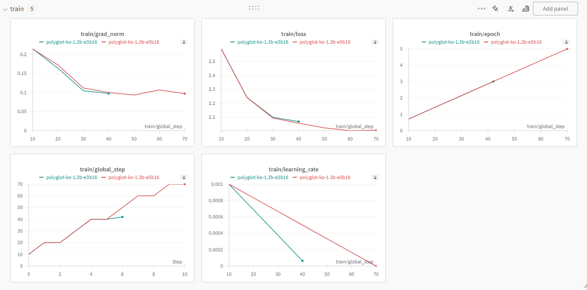
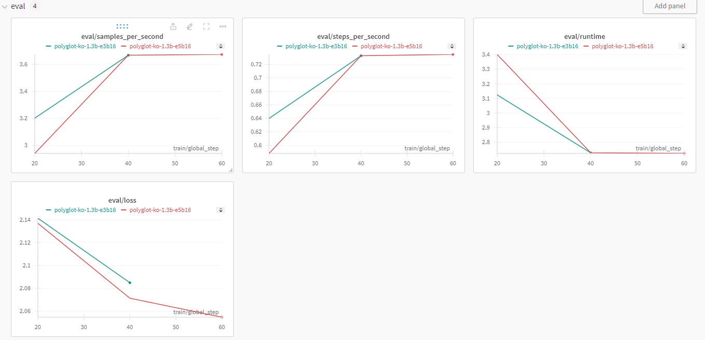
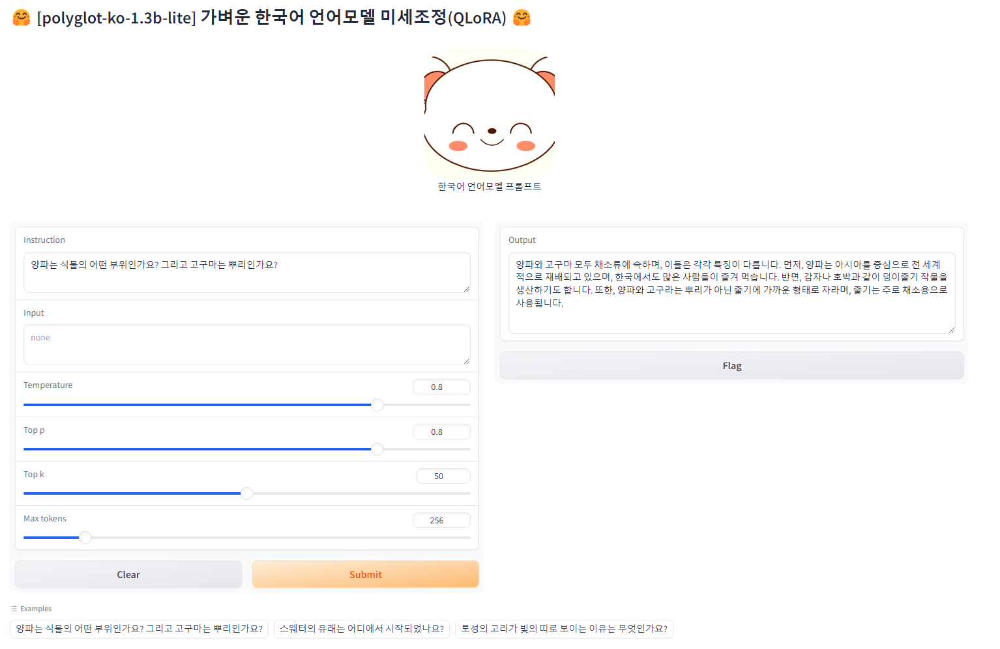

# Polyglot-ko-1.3b-lite

[EleutherAI/polyglot-ko-1.3b](https://huggingface.co/EleutherAI/polyglot-ko-1.3b/)를 기반으로, PEFT 기법 중에 하나인 QLoRA로 미세조정한 모델입니다.<br/>
본 프로젝트로 제작한 미세조정 모델은 [Huggingface](https://huggingface.co/JoonkyuBest/polyglot-ko-1.3b-lite1.0)에 올려져 있습니다.<br/>
본 프로젝트를 사용하여, 새롭게 미세조정한 모델을 제작하실 수 있습니다.<br/>
본 프로젝트의 기반인 Polyglot 모델에 대한, 자세한 정보는 [여기](https://github.com/EleutherAI/polyglot)를 참조하세요.

본 프로젝트는 Windows 시스템 상에서 제작되었습니다.
- 기반 모델은 HuggingFace로부터, 직접 [다운로드](#기반모델-다운로드) 받아야 합니다.
- 훈련 데이터셋은 ko-datasets 폴더에 존재하며, GPT2에 기반한 eos_token 포맷을 사용합니다.
- 순수 Windows 모델과 WSL2 모델 간에, [훈련/평가]된 gradio 그래프를 비교해 보면, 차이점이 있다는 것을 알 수 있습니다.


## 개발 목적
사양이 높지 않은 일반 노트북에서, 한국어 LLM을 연구, 개발할 수 있는 환경을 구축해 본 것입니다.<br/>
AI개발 속도가 너무 빠르게 진행되어, 과거 호환성 문제를 해결하며, 구축해야만 했습니다.<br/>
자신의 모델이 응답속도가 늦거나, 엉뚱한 답변을 생성하는 것은, LLM에 대한 지식이 부족해서 발생하는 것입니다.<br/>
본 소스를 기반으로 삼아, Windows 개발자 분들이 AI 개발의 문턱에 빠르게 다가설 수 있기를 바랍니다.


## 구현 환경

RAM은 거의 소모하지 않으며, VRAM은 2.7 GB를 소비합니다.
```
- System
  OS            Windows 11 Home
  RAM           16 GB
  VRAM	        2.7 GB
  Graphic Card  GeForce RTX 3060(GPU=1, VRAM=6GB)

- packages
  cuda          12.1.105
  cudnn         8.0
  pytorch       2.2.2
  python        3.10.14
  conda         24.3.0
  accelerate    0.29.2
  bitsandbytes  0.43.0
  gradio        4.26.0
  tokenizers    0.15.2
  transformers  4.39.3
  wandb         0.16.6

- training parameters
  epochs                5
  batch_size            16
  micro_batch_size      4
  learning_rate         1e-3
  batch_size            3
  lora_r                8
  lora_alpha            16
  lora_dropout          0.05
  lora_target_modules   query_key_value
```


## 기반모델 다운로드
- `./resources/polyglot-ko-1.3b` 로컬 폴더에, HuggingFace로부터 [기반모델](https://huggingface.co/EleutherAI/polyglot-ko-1.3b/tree/main)을 다운로드 하세요.
- Windows 사용자라면, 모델 LFS 폴더들을 한 곳에 위치시키고 공유하기 위한, `.create-symbolic-links.bat` 파일을 수정하여, `resources` 폴더의 심볼릭링크를 생성시키는 것이 좋습니다.


## AI 개발환경 구축

- 순수한 Windows 시스템 상에, 본 프로젝트의 개발환경을 구축하려면 [여기](./INSTALL-Win.md) 문서를 참조하세요.
- Windows WSL2 가상환경 상에, 본 프로젝트의 개발환경을 구축하려면 [여기](./INSTALL-WSL.md) 문서를 참조하세요.


## [훈련/병합/추론]을 위한, 공통된 사전 작업
출력 경로의 e3b16은 epochs=3, batch_size=16을 의미합니다.<br/>
출력 경로의 e5b16은 epochs=5, batch_size=16을 의미합니다.

[훈련/병합/추론] 콘솔명령들을 수행하기 전에, 아래의 작업들이 진행된 상태여야만 합니다.
```
1. Python 가상환경으로 전환된 상태에서, 진행하셔야 합니다.
  > conda activate pgko
2. [transformers] 라이브러리를 사용하기 위해서는, (브라우저로) HuggingFace에 로그인된 상태여야만 합니다.
  > https://huggingface.co/
3. [WandB] 회원가입이 필요하며, (브라우저로) WandB에 로그인된 상태에서, API-KEY를 콘솔창에 입력해야만 합니다.
  > https://wandb.ai/site
```

## 훈련

### 미세조정(QLoRA)
LoRA(Low-Rank Adaptation)와 QLoRA는 LLM을 효율적으로, 미세조정하기 위한 기술입니다.<br/>
이들은 매개변수를 효율적으로 관리하고, 메모리 사용량을 줄이는 목적으로 개발되었습니다.<br/>
이러한 기술은 LLM을 효율적으로 조정하고, 비용을 절감하는 데 도움이 됩니다.

```bash
> python finetune-lora.py \
  --base_model 'resources/polyglot-ko-1.3b' \
  --data_path 'ko-datasets/KoAlpaca_v1.1a_textonly.json' \
  --output_dir 'train/lora-e5/b16' \
  --cache_dir './data' \
  --num_train_epochs 5 \
  --batch_size 16 \
  --lora_r 8 \
  --learning_rate 1e-3 \
  --lora_target_modules "['query_key_value']"

> python finetune-lora.py --base_model 'resources/polyglot-ko-1.3b' --data_path 'ko-datasets/KoAlpaca_v1.1a_textonly.json' --output_dir 'train/lora-e5/b16' --cache_dir './data' --num_train_epochs 5  --batch_size 16 --lora_r 8 --learning_rate 1e-3 --lora_target_modules "['query_key_value']"
> python finetune-lora.py --base_model 'resources/polyglot-ko-1.3b' --data_path 'ko-datasets/KoAlpaca_v1.1a_textonly.json' --output_dir 'train/lora-e3/b16' --cache_dir './data' --num_train_epochs 3  --batch_size 16 --lora_r 8 --learning_rate 1e-3 --lora_target_modules "['query_key_value']"
```


## 병합 저장(기반모델 + PEFT 가중치)
병합은 기반모델인 [polyglot-ko-1.3b]과, 미세조정 훈련한 가증치 어댑터(peft_root)를, 하나로 합쳐서 저장시키는 작업입니다.

```bash
> python merge-lora.py \
  --base_model 'resources/polyglot-ko-1.3b' \
  --peft_root 'train/lora-e5/b16' \
  --output_dir 'resources/polyglot-ko-1.3b-e5b16' \
  --max_shard_size '1GB'

> python merge-lora.py --base_model 'resources/polyglot-ko-1.3b' --peft_root 'train/lora-e5/b16' --output_dir 'resources/polyglot-ko-1.3b-e5b16' --max_shard_size '1GB'
> python merge-lora.py --base_model 'resources/polyglot-ko-1.3b' --peft_root 'train/lora-e3/b16' --output_dir 'resources/polyglot-ko-1.3b-e3b16' --max_shard_size '1GB'
```


## 추론(LoRA)
추론은 학습(훈련)시킨 [데이터셋](./ko-datasets/KoAlpaca_v1.1a_textonly.json)을 토대로, 얼마나 정확하게 답변을 생성시키는지를 확인하는 것입니다.

```bash
1. 콘솔창에서 아래의 명령을 수행시킵니다.
  > python generate.py \
      --load_4bit True\
      --base_model 'resources/polyglot-ko-1.3b'  \
      --peft_root 'train/lora-e5/b16' \
      --cache_dir './data'
- PEFT 어댑터 활용
  > python generate.py --load_4bit True --base_model 'resources/polyglot-ko-1.3b' --peft_root 'train/lora-e5/b16' --cache_dir './data'
    python generate.py --load_4bit True --base_model 'resources/polyglot-ko-1.3b' --peft_root 'train/lora-e3/b16' --cache_dir './data'
- 병합모델 사용
  > python generate.py --load_4bit True --base_model 'resources/polyglot-ko-1.3b-e5b16' --cache_dir './data'
    python generate.py --load_4bit True --base_model 'resources/polyglot-ko-1.3b-e3b16' --cache_dir './data'
2. 브라우저를 열고, 아래의 주소를 입력합니다.(포트가 다를 수 있으니, 콘솔창에 출력된 주소를 확인하세요.)
  > http://127.0.0.1:7860/

3. 아래와 같이 텍스트박스에, 프롬프트 명령을 입력하시고, submit 버튼을 클릭하세요.
  > Instruction:  {x}가 뭐지?
  > Input: AI

4. "AI가 뭐지?"라는 질문이 LLM 모델에 전달될 것이며, 답변이 Output에 출력될 것입니다.
```

<br/><br/>
------

## 스크린 샷
두 그래프에 차이점을 확인하세요.

### 훈련 그래프

[](./assets/gradio-train.png)

### 평가 그래프

[](./assets/gradio-eval.png)

### 추론(생성) 프롬프터

[](./assets/prompter.png)


## 라이센스

[Apache 2.0](./LICENSE) 라이센스를 따릅니다.<br/>
라이센스에 따라, 주의사항을 지켜주시기 바랍니다.
